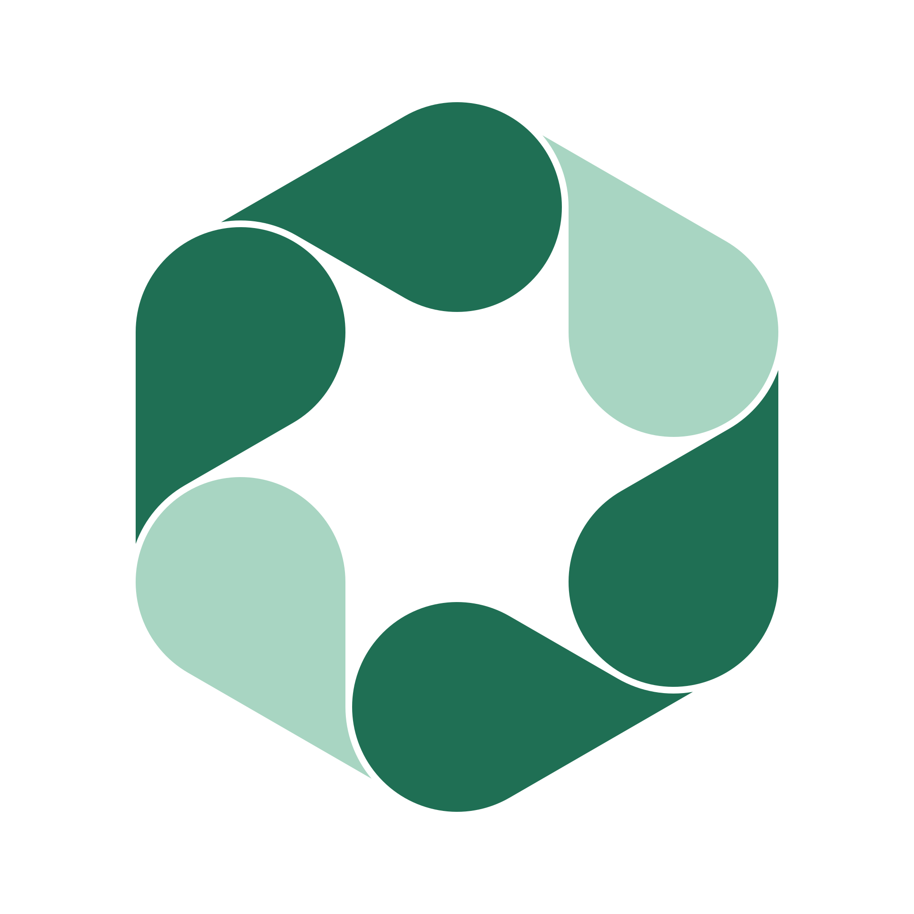
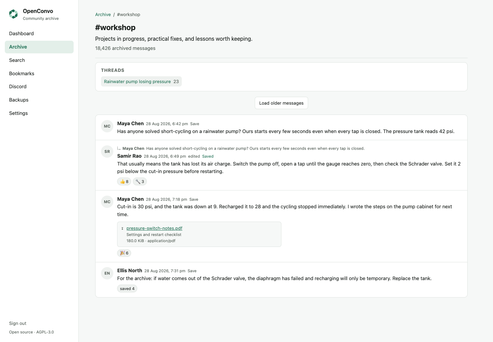

<p align="center">
  
</p>

<h1 align="center">OpenConvo</h1>

<p align="center"><strong>Keep your own copy of your community's knowledge.</strong></p>

<p align="center">
  OpenConvo is an open-source, self-hosted archive for communities that live in chat.<br>
  Connect your Discord server and it archives the channels you choose, attachments and all,
  faithfully and privately, in a database and open export formats you own.<br>
  Then browse, search and curate on top of it.
</p>

---

> **Status: approaching 1.0.** Every planned milestone has shipped: sync,
> attachments, browsing, search, exports, backups, curation. The
> [1.0 acceptance scenario](docs/roadmap.md#10-acceptance-scenario) is now being
> exercised against a live Discord community; fixes from that testing will land
> before 1.0. The [roadmap](docs/roadmap.md) has the details.



*The screenshots use fictional, synthetic community data.*

## Your community's knowledge lives on someone else's server

Communities solve real problems in chat every day. Answers, recommendations
and hard-won techniques accumulate quickly, then disappear into scrollback.
Newcomers ask the same questions again, and useful context gets separated
from the answer. None of it is really yours, either. It sits in an account you
do not control, under a retention policy you did not write, one deleted
channel, removed bot or dying platform away from being gone.

OpenConvo puts it in your custody:

**Capture → Preserve → Find → Curate**

The faithful archive is the foundation, not the product's ceiling. Keeping the
original conversation and its context intact is what makes everything built on
top of it trustworthy: search, exports and any AI you point at the archive read
a copy you hold, rather than a summary that replaces it.

## What you get

- **Private by default.** Nothing is captured until you explicitly enable a
  channel, and DMs never are. The archive stays behind an administrator login,
  published nowhere. Deletions on Discord are honored in the live archive and
  recorded in a deletion ledger: what was removed, and when. The ledger travels
  with every export, so `openconvo replay-deletions` can re-apply newer
  deletions to a database restored from an older backup; the
  [restore guide](docs/self-hosting.md#restoring-a-database-backup) has the
  details.
- **Own your community's knowledge.** Everything lives in your PostgreSQL and
  on your own disk or bucket. Checksummed JSONL exports, human-readable
  Markdown renderings, independent verification and scheduled off-site
  database backups keep the data portable and useful even if Discord,
  OpenConvo or its maintainers disappear.
- **The whole conversation, faithfully.** Connect a Discord bot, select the
  channels worth keeping, and OpenConvo backfills their full history, then
  stays synchronized live: messages, edits, deletions, reactions, threads and
  attachments, not just the questions that got answered. Sync resumes after
  restarts and catches up on what it missed while disconnected.
- **Preserve context, not just messages.** Browse channels, threads and message
  timelines behind an administrator login. Permanent links open any message
  in its surrounding conversation, so an answer still makes sense years after
  it originally scrolled away.
- **Find useful knowledge again.** Relevance-ranked full-text search includes
  channel, author, date and attachment filters. Optional semantic search
  (bring your own OpenAI key) helps when you remember the meaning but not the
  words. An optional read-only [MCP endpoint](docs/mcp.md) lets your own AI
  tools search the archive too.
- **Curate what is worth keeping.** Bookmark important messages, add titles
  and descriptions, and organize them with tags and collections. Members with
  permission can save a message straight from Discord with the built-in
  **Archive** action.
- **Boring to run.** One Go binary plus PostgreSQL, deployed as two containers
  with Docker Compose. No Kubernetes, no Redis, no required external services.
  Install it once and leave it alone for years.
- **Complete, not crippled.** Capture, browse, search, curate and export: the
  open-source edition is the whole product, not a teaser for a paid tier.

Want to make a *public* Discord findable on Google? That is a different job,
and a different tool does it well.
[How OpenConvo compares](docs/comparison.md) says which.

## Get started

All you need is Docker with Compose, on any host that can run two small
containers; a 1 GB VPS is fine.

```bash
git clone --branch v0.1.1 --depth 1 https://github.com/openconvo/openconvo
cd openconvo

./scripts/install.sh
```

The guided installer walks you through Discord, attachment storage, off-site
backups and semantic search, asking for credentials only for the features you
enable, then starts OpenConvo. Open the address it prints, sign in, connect
your bot and select channels; your knowledge archive starts filling
immediately.

Creating a fresh cloud server? `scripts/cloud-init.yaml` prepares it at first
boot; see [provisioning a new server](docs/self-hosting.md#provisioning-a-new-server).
Prefer doing it by hand? See the [manual install](docs/self-hosting.md#install).

## How it works

```text
                     Discord (first source)
                        │  HTTP + Gateway
                        ▼
              ┌───────────────────────┐
              │      openconvo        │   one Go binary:
              │  source adapters      │   API + frontend + ingestion
              │  ingestion & jobs     │   + background jobs
              │  HTTP API + React UI  │
              │  search & export      │
              └───────────┬───────────┘
                  ┌───────┴────────┐
                  ▼                ▼
             PostgreSQL      attachment blobs
         (archive + search   (content-addressed,
            + job queue)      filesystem or S3)
```

One design rule sits behind everything: *if every derived system disappeared,
the canonical data must still faithfully reconstruct the archive.* Search
indexes, exports and anything AI-generated are derived data: rebuildable,
disposable, never load-bearing.

## Documentation

Start with the [documentation index](docs/README.md) for the complete map.

- [How OpenConvo compares](docs/comparison.md): the job it does, and when
  a different tool is the right one
- [Self-hosting guide](docs/self-hosting.md): install, connect Discord,
  select channels, attachments, backups, secure network exposure, operations
- [Configuration reference](docs/configuration.md): every environment variable
- [Upgrades](docs/upgrades.md): upgrade detection, procedure, rollback
- [MCP search](docs/mcp.md): read-only archive search from an MCP client
- [Architecture](docs/architecture.md) and the
  [archive format](docs/archive-format.md): how it is built, and the export
  format your data lives in
- [Roadmap](docs/roadmap.md): status, limitations, deliberate non-goals

## Privacy

Capturing community chat carries real responsibility. OpenConvo archives only
explicitly selected guild channels and never DMs, honors message deletions,
and keeps archives private by default. See
[docs/architecture.md](docs/architecture.md#privacy-and-deletion).

The software gives you the controls; the authority to use them is yours.
Archive only servers you administer or have the owner's permission to archive,
tell your members which channels are archived and who can read the archive,
decide how long you keep it and who may search it, and stay within Discord's
Terms of Service and Developer Policy and the law that applies to you and your
members.

## Contributing

OpenConvo is open source, but **not open to external code contributions**.
Bug reports, feature requests and feedback through
[issues](https://github.com/openconvo/openconvo/issues) are wanted and read;
pull request creation is restricted to collaborators. The copyright stays
under a single owner so the licensing can stay flexible;
[CONTRIBUTING.md](CONTRIBUTING.md) explains the reasoning and what helps most
instead.

## Development

One Go module with a React frontend embedded in the binary. `make help` lists
all targets; [CONTRIBUTING.md](CONTRIBUTING.md) has the development setup,
project layout and conventions.

## License

Copyright 2026 OpenConvo contributors.

[GNU Affero General Public License v3.0 or later](LICENSE) (AGPL-3.0-or-later).

OpenConvo is free software: run it, study it, change it and share it. The
Affero clause is the point: if you modify OpenConvo and let anyone reach your
modified version over a network, you must offer those users the source of your
version. A hosted fork cannot stay closed.
