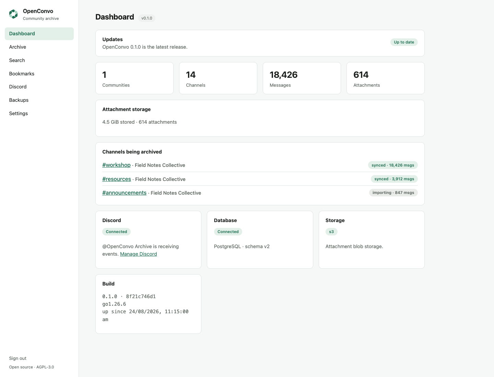
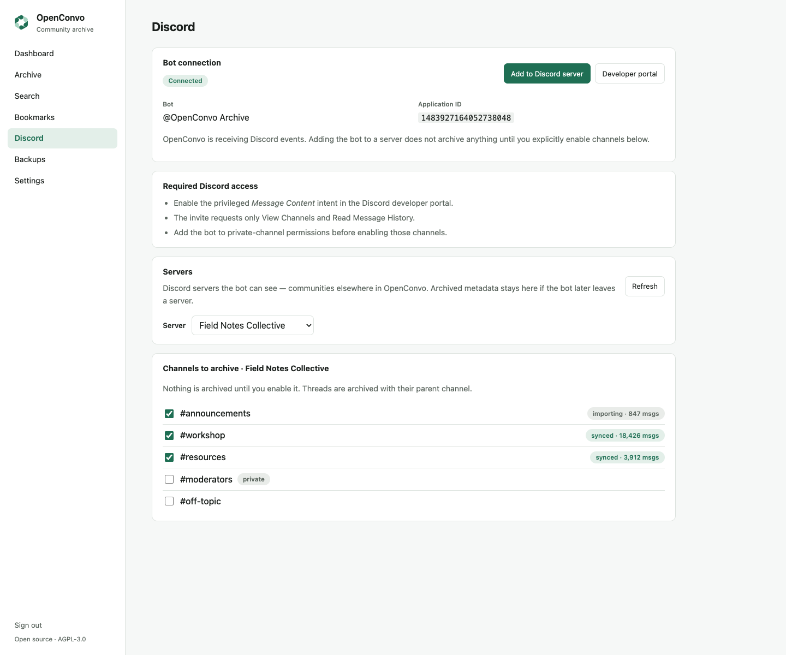
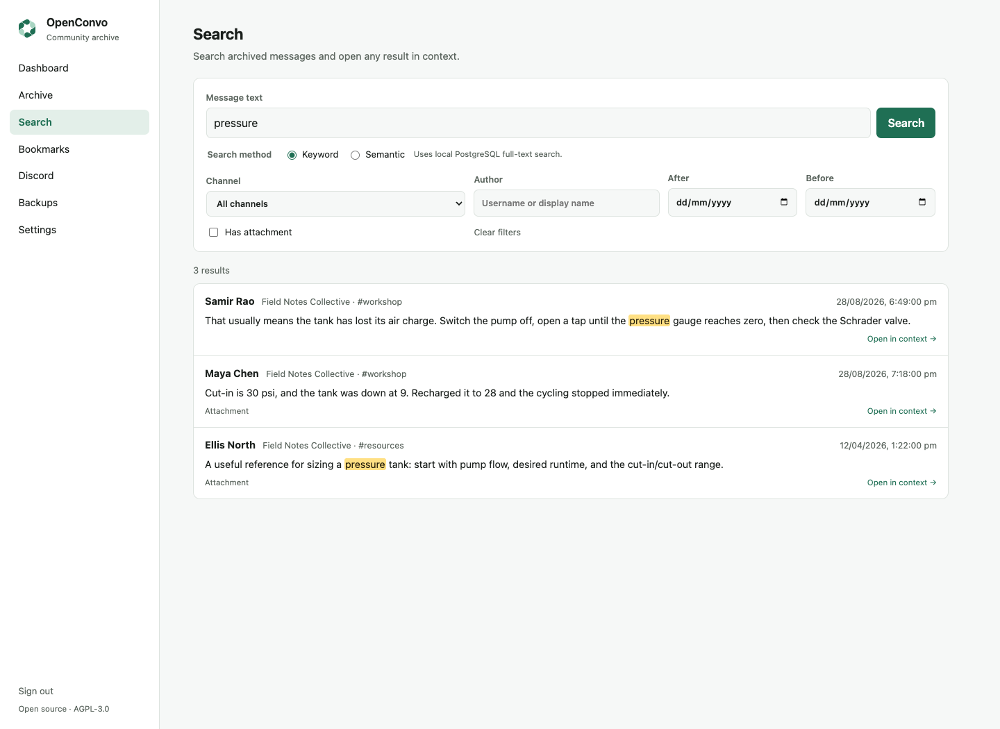
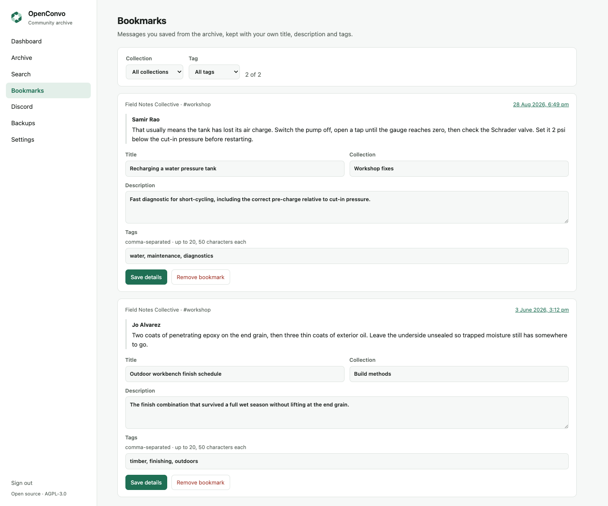
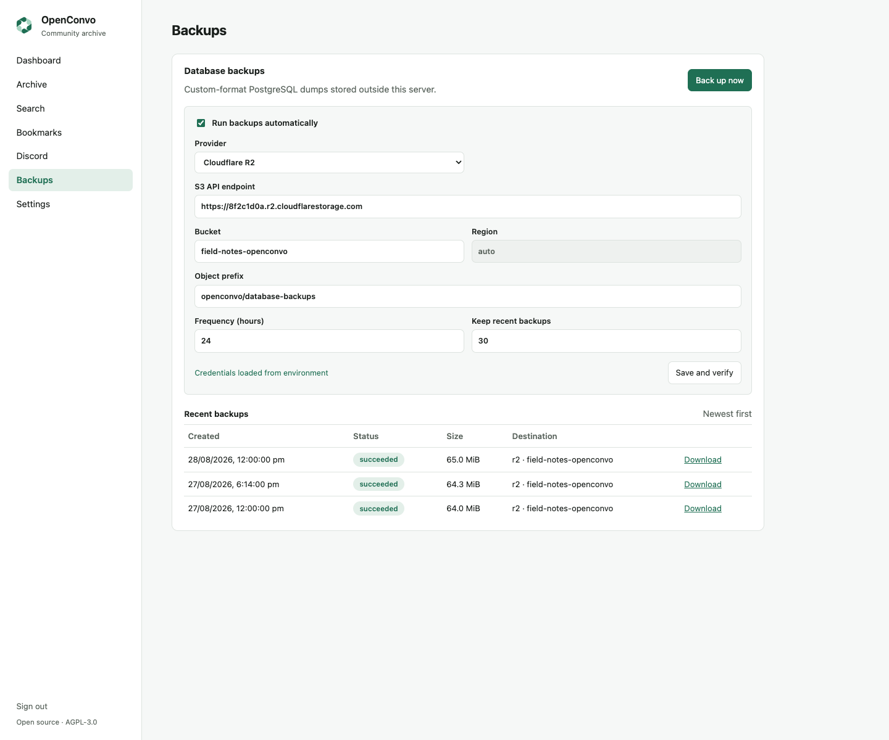

# Self-hosting OpenConvo

OpenConvo is designed to be boring to run: one application container, one
PostgreSQL container, and a volume for each. This guide covers installation,
Discord connection, storage, backups, upgrades and routine operations.

> **Current access model:** archives are private and administrator-only.
> The public-internet setup in this guide is for secure remote administrator
> access; it does not create an anonymous community archive.

## Install

Requirements: Docker with the Compose plugin, on any host that can run two
small containers (a 1 GB VPS is fine to start).

OpenConvo needs PostgreSQL with the **pgvector** extension, and pgvector is
not optional. The migrations create the `vector` extension and an HNSW index on
every installation, whether or not semantic search is ever enabled, so
`openconvo migrate` fails outright against a PostgreSQL server without it. The
Compose deployment uses the pgvector PostgreSQL 17 image, so a Docker install
has nothing extra to do; see [running without Docker](#running-without-docker)
if you supply your own PostgreSQL.

```bash
git clone --branch v0.1.1 --depth 1 https://github.com/openconvo/openconvo
cd openconvo

./scripts/install.sh
```

### Provisioning a new server

On a server you are creating from scratch, `scripts/cloud-init.yaml` does the
parts of the setup that hold no decisions: Docker, a firewall that opens 22, 80
and 443 and nothing else, Caddy configured for your domain, swap, and a clone of
OpenConvo in `/opt/openconvo`. Change the domain in its Caddyfile block, paste
it into your provider's user-data field when you create the machine
(DigitalOcean calls it Advanced Options → Add Initialization scripts, and
Hetzner, Vultr and AWS have the same box), then SSH in and run
`./scripts/install.sh` from `/opt/openconvo`.

It stops short of running the installer, and that is the point. `install.sh`
asks for the administrator password, and user data is not a secret store:
providers retain it, display it in their control panel, and anything running on
the machine can read it back from the metadata service for the life of the
server. A password put there is a password published.

Running at first boot is also what lets that file be so direct. It executes once,
on a machine with nothing else on it, so it never has to reason about an
existing web server, an established firewall policy, or a half-configured
Docker, and a mistake costs a destroyed server rather than a debugging session.
On a machine that already exists, follow the sections below instead.

The guided installer asks about Discord, attachment storage, off-site backups,
and semantic search. Optional features default off, and their settings appear
only when enabled. It generates a separate database password, writes the
gitignored `.env` with mode `0600`, shows a secret-free summary, and starts
OpenConvo. It refuses to replace an existing `.env`, so rerunning it cannot
silently change the password of an initialized PostgreSQL volume.

The web port publishes on `127.0.0.1` by default. The installer can configure
that address for a local TLS reverse proxy, or print an SSH tunnel command for
private first access. Publishing plaintext HTTP on every interface requires a
separate explicit confirmation.

For a manual installation, copy `.env.example` to `.env` and set
`POSTGRES_PASSWORD` and `OPENCONVO_ADMIN_PASSWORD`. Both ship empty and
Compose refuses to start without either, so a copied-but-unedited file fails
before the containers exist rather than restarting forever afterwards. Every
other setting is optional; [configuration.md](configuration.md) lists them
all. Then run:

```bash
docker compose pull openconvo
docker compose up -d
```

The guided installer pulls the exact `ghcr.io/openconvo/openconvo:0.1.1`
image selected by this release. A missing image, registry authentication
problem, or network failure stops with the original error; none of those
conditions silently substitutes source code. To deliberately install a build
from the working tree, say so explicitly:

```bash
./scripts/install.sh --build-from-source
```

For later development runs, add the development overlay directly:

```bash
docker compose -f compose.yaml -f compose.dev.yaml up -d --build
```

`compose.yaml` has no build section of its own, so a stray `--build` on a
deployment running released images cannot quietly replace one with whatever
happens to be in the checkout. Building is something you opt into by naming
the overlay.

Published images identify stable versions and receive compatibility-aware
update notices in the dashboard. Checkout builds identify themselves as
development builds; their update procedure is documented separately.

Open the address the installer prints. The dashboard shows system status;
`docker compose exec openconvo openconvo status` shows the same from the
terminal.



The screenshots in this guide use fictional, synthetic community data.

### Verifying the published image

Each release publishes a build provenance attestation for its image, and from
v0.1.1 an SBOM attestation as well, through GitHub's artifact attestation
service. With the [GitHub CLI](https://cli.github.com/) installed:

```bash
docker pull ghcr.io/openconvo/openconvo:0.1.1
docker run --rm ghcr.io/openconvo/openconvo:0.1.1 version
gh attestation verify oci://ghcr.io/openconvo/openconvo:0.1.1 -R openconvo/openconvo
```

`version` prints the release version and the commit its tag points to, and
`gh attestation verify` confirms the image was built by this repository's
release workflow from that tag. The same commands work for any later version.

## Administrator sign-in

OpenConvo requires one built-in administrator password before it will serve.
Set a password of at least 12 characters in `.env`:

```bash
OPENCONVO_ADMIN_PASSWORD=<a-long-unique-password>
```

The password remains process configuration and is never stored in the archive
or logged. Successful login creates an HTTP-only, SameSite-strict session
cookie lasting 12 hours. The key that signs those cookies is generated fresh at
every start, so every session ends when OpenConvo restarts, including the
restart a changed administrator password needs to take effect.

Terminate TLS in front of OpenConvo before exposing it beyond localhost. When
the reverse proxy supplies `X-Forwarded-Proto: https`, OpenConvo marks the
session cookie `Secure`.

A fresh installation archives nothing until you connect a bot and select
channels; the next two sections cover both.

## Connecting Discord

1. At <https://discord.com/developers/applications>, click **New
   Application**, name it, and create it. Copy the **Application ID** from
   the General Information page into `DISCORD_APPLICATION_ID` in `.env`.
2. Open the **Bot** page in the left sidebar. Under **Privileged Gateway
   Intents**, enable **Message Content Intent** and save. Without it,
   Discord refuses the connection with close code 4014, and OpenConvo logs
   exactly that. (Bots past Discord's verification threshold need Discord's
   approval for this intent; check their current documentation.)
3. Still on the Bot page, click **Reset Token**, confirm, and copy the token
   into `DISCORD_TOKEN` in `.env`. Discord shows it once. Treat it like a
   password: their developer terms require keeping credentials confidential,
   and OpenConvo never logs it.
4. Restart with the token: `docker compose up -d`. Compose recreates the
   container because `.env` changed. Then watch
   `docker compose logs -f openconvo` for

   ```text
   level=INFO msg="gateway ready" component=discord.gateway bot=<your bot's name>
   ```

   That line means the token and intents are both accepted.
5. Invite the bot to your server with

   ```text
   https://discord.com/oauth2/authorize?client_id=<DISCORD_APPLICATION_ID>&scope=bot%20applications.commands&permissions=66560
   ```

   Those permissions are **View Channels** and **Read Message History**:
   everything OpenConvo needs, and nothing that lets it post or moderate.
   The Discord page links to this URL for you once the application ID is
   configured. Inviting requires **Manage Server** on the target server.

OpenConvo sees a channel only if the bot's roles can view it. For private
channels, add the bot to the channel's permissions, or its backfill records
a `Missing Access` error against that channel.

OpenConvo registers an **Archive** message action when it starts. Discord may
take a little time to propagate a global command. A member with **Manage Server**
can right-click an already archived message, choose **Apps → Archive**, and save
it to OpenConvo; the response is visible only to that member. The action cannot
archive an unselected channel or fetch a message OpenConvo does not already
hold. Add titles, descriptions, tags and collection names on the Bookmarks page.

OpenConvo only works as an official bot. It will refuse tokens that belong
to user accounts (self-bots violate Discord's terms).

### Before you archive

OpenConvo enforces channel selection and its privacy defaults; being entitled
to archive is on you. Archive only servers you administer or have the owner's
permission to archive, tell members which channels are archived and who can
read the archive, decide retention and access deliberately, and stay within
Discord's Terms of Service and Developer Policy and the law that applies to you
and your members.

## Selecting channels

Open **Discord**. Once the bot has joined, your server and its channels
appear there.

- Tick a channel to start archiving it. OpenConvo works backward through its
  full history while live messages keep flowing in, and the
  chip beside the channel shows progress (`importing` → `synced`).
- Threads are archived with their parent channel; you never select them
  individually.
- Unticking a channel stops archiving. What was already archived is kept.
- Nothing else is touched: unselected channels and DMs are never archived.



An interrupted import resumes from its last checkpoint on restart, so
restarting OpenConvo mid-backfill is safe. `docker compose exec openconvo
openconvo status` lists the same per-channel progress from the terminal.

## Browsing the archive

Open **Archive** after signing in. It lists preserved channels and their
threads by community. A channel timeline opens at its newest messages and
loads older pages on demand. Disabling a channel stops future ingestion but
does not hide its retained history.

Every message timestamp links to a stable `/messages/<archive-id>` URL. That
page shows the message with up to twenty messages before and after it, so a
saved link remains useful even if the source channel is later renamed.
Replies link to their archived parent when it is still available. Stored
attachments download through OpenConvo itself; pending or failed files keep
their archived filename and metadata without falling back to an expiring
Discord URL.

## Finding and curating

**Search** uses local PostgreSQL full-text search by default. Filter results by
channel, author, date or attachment, then open any match in its surrounding
conversation. Optional semantic search uses the same filters and remains a
disposable index over the canonical messages.



Save an important message from its timeline or through Discord's **Archive**
message action. **Bookmarks** add a title, description, tags and collection
without changing the archived source message.



## Archiving attachments

OpenConvo records what was attached to every message from the start, but
does not download the files unless you ask it to. Storing a community's
history of images and videos is an open-ended disk commitment (a single
active channel can run to tens of gigabytes), so it is a deliberate
choice rather than a default.

To turn it on, set this in `.env` and restart:

```bash
OPENCONVO_ATTACHMENTS_ENABLED=true
```

### S3-compatible object storage

For archives that should not live on the application server, OpenConvo can
store attachments in AWS S3, Cloudflare R2, DigitalOcean Spaces, MinIO, or a
similar S3-compatible service. Create a **private, dedicated bucket for each
OpenConvo installation**. Sharing a bucket between installations is unsafe:
content-addressed keys can overlap, and one installation may reclaim an object
the other still references.

Set the common values in `.env`:

```bash
STORAGE_DRIVER=s3
S3_REGION=<provider-region>
S3_BUCKET=<bucket-name>
S3_ACCESS_KEY=<access-key-id>
S3_SECRET_KEY=<secret-access-key>
OPENCONVO_ATTACHMENTS_ENABLED=true
```

Then add the provider-specific endpoint:

| Provider | `S3_ENDPOINT` | `S3_REGION` | Path style |
| --- | --- | --- | --- |
| AWS S3 | leave empty | bucket's AWS region | `false` |
| Cloudflare R2 | `https://<ACCOUNT_ID>.r2.cloudflarestorage.com` | `auto` | `false` |
| DigitalOcean Spaces | `https://<REGION>.digitaloceanspaces.com` | Spaces region, such as `nyc3` | `false` |
| MinIO | server URL, such as `http://minio:9000` | server's signing region, commonly `us-east-1` | usually `true` |

Set `S3_FORCE_PATH_STYLE=true` for providers that require the bucket in the
URL path. `S3_SESSION_TOKEN` is also available for temporary credentials. The
credentials need permission to inspect the bucket and to read, write, inspect,
and delete its objects. OpenConvo checks bucket access during startup and
refuses to run with an unreachable bucket rather than silently accumulating
undownloaded files.

Keep public access, versioning, object retention, lifecycle expiry, and Object Lock off.
Expiry can destroy canonical attachment bytes, while retention or versioning
can preserve files after OpenConvo has been told to delete them. Use the
provider's encryption-at-rest option if it is not already the default.

OpenConvo computes the SHA-256 key before uploading, so an S3 download is
staged in the container's temporary directory. At most the configured per-file
limit is staged for each active download (two downloads run concurrently by
default); no permanent attachment archive remains on the server.

Do not change `STORAGE_DRIVER` on an archive that already has stored files
until those objects have been copied. The database records which attachments
are stored; switching the setting does not migrate them or download them again.
Filesystem objects under `STORAGE_PATH/sha256/` map directly to S3 keys under
`sha256/`, so copy and verify that tree first, then switch drivers. Keep the
old copy until the archive has successfully opened attachments from S3.

Files already archived are downloaded too, not just new ones. Discord's
file links expire after about a day, but OpenConvo refreshes them
automatically, so switching this on later loses nothing.

Downloading follows your channel selection: unticking a channel stops
OpenConvo fetching its files, the same way it stops archiving its
messages. Files already stored are kept.

Files above `OPENCONVO_ATTACHMENT_MAX_BYTES` (100 MiB by default) are
skipped and recorded as failed with a reason. If storage runs low or a
write fails partway, OpenConvo leaves the affected files pending and
keeps retrying rather than giving up on them; free up space and they
pick up again on their own, within about five minutes.

A file that keeps failing for other reasons (gone from Discord, or a
download that went wrong for the twenty-odd minutes of retries it gets)
is recorded as `failed` and not tried again. To offer every failed file to
the pipeline once more, after fixing whatever caused it:

```bash
docker compose exec -T postgres psql -U openconvo -d openconvo -c \
  "UPDATE attachments SET download_status = 'pending', download_error = NULL WHERE download_status = 'failed';"
```

Files that really are gone from Discord fail again, with the reason in
`download_error`. A `openconvo attachments retry` command to do this
without SQL is planned.

The dashboard and `openconvo status` show how many files are stored,
pending and failed, and how many bytes they add up to.

Deleting a message deletes its files too: OpenConvo reclaims blobs that
nothing references any more, every hour.

Stored files are available to authenticated administrators at
`/api/v1/attachments/<attachment-uuid>/content`. OpenConvo restores the
original filename and media type while forcing a download with `nosniff`, so
untrusted attachment content cannot execute on the archive's origin.

In rare cases (a download that failed partway through, or OpenConvo
crashing between storing an object and recording its database row) an object
can be left without the row reclamation needs to find it. Check database
references, hash every recorded blob, and enumerate storage with:

```bash
docker compose exec openconvo openconvo verify
```

The check is read-only. If it reports untracked objects or stale temporary
files, remove them with `openconvo verify --repair`. OpenConvo waits until
they are at least one hour old before treating them as abandoned, so this is
safe alongside ordinary downloads. Unknown files outside OpenConvo's exact
content-addressed layout are reported but never automatically deleted.

## Optional message embeddings

OpenConvo can build a disposable semantic index for each non-empty,
non-deleted archived message. It is off by default. Enabling it sends the
exact archived message text to OpenAI, so only enable it when that transfer is
acceptable for the community and consistent with your privacy obligations.
No attachments, actor profiles, raw source payloads, or API credentials are
sent by this pipeline. Deleted messages are excluded when work is selected, but
a message deleted while its text is already in flight cannot be recalled;
OpenConvo discards the returned vector instead of storing it.

The first preset is intentionally fixed:

| Setting | Value |
| --- | --- |
| Provider | OpenAI |
| Model | `text-embedding-3-small` |
| Dimensions | `256` |
| Input | Exact message content (`message-content-v1`) |

Add the credential to `.env`, restart, then use **Settings → Message
embeddings** to opt in:

```dotenv
OPENAI_API_KEY=<your-api-key>
```

Alternatively, `OPENCONVO_EMBEDDINGS_ENABLED=true` provides an explicit
environment-level initial opt-in and requires `OPENAI_API_KEY`. A setting
saved from the dashboard becomes authoritative for subsequent starts. The
credential always remains in the environment and never enters the browser or
database. Enabling first sends a fixed connection-check sentence; archived
content is queued only after that succeeds.

Vectors live in the same PostgreSQL service but in a separate `derived`
schema. This keeps the default deployment at two containers without making
the archive depend on the index. Edits and deletions remove stale vectors
transactionally; background jobs regenerate missing rows. OpenConvo's own
scheduled backups exclude the `derived.message_embeddings` table data, so they
carry no vectors and the rows are regenerated from canonical messages after a
restore. A dump you take yourself (`scripts/backup.sh`, or a plain `pg_dump`)
includes them, and is correspondingly larger.

The Compose deployment uses the PostgreSQL 17 image supplied by pgvector. An
existing PostgreSQL 17 Compose volume can move from the previous stock image
with the normal upgrade command below; the data directory is reused and the
startup migration installs the extension. Bare-process installations must
install the pgvector extension for their PostgreSQL server before running
OpenConvo migrations.

Once the Settings panel reports the generation as `active`, open **Search**
and choose **Semantic**. OpenConvo sends that search query to OpenAI, compares
its 256-dimension vector with the active local pgvector index, and returns the
nearest messages. Channel, author, date, and attachment filters work in both
modes. Semantic excerpts are plain bounded message text because there is no
literal keyword to highlight. Choose **Keyword** for the default, entirely
local PostgreSQL full-text search; it remains available if OpenAI is down or
embeddings are disabled. OpenConvo never silently substitutes one mode for
the other.

Alternative providers such as Cloudflare Vectorize remain future work.

## Portable exports

Create the documented JSONL archive plus content-addressed attachment files,
a manifest, and SHA-256 checksums:

```bash
docker compose exec openconvo \
  openconvo export --output /data/openconvo-export-$(date +%F)
docker compose exec openconvo \
  openconvo verify /data/openconvo-export-$(date +%F)
```

Add a human-readable Markdown view without giving up the canonical JSONL data:

```bash
docker compose exec openconvo \
  openconvo export --format markdown --output /data/openconvo-markdown-$(date +%F)
```

Open `markdown/README.md` in the resulting directory. Channel and thread files
link to verified attachment objects within the same portable export.

The destination must not already exist. Export writes through a sibling
temporary directory and publishes only after every database record and blob
has been copied and hashed. Copy the finished directory off the container or
host; it is usable with ordinary JSON and checksum tools and does not depend
on OpenConvo or PostgreSQL. The directory is created private to the operating
user, and should stay private: it contains full message content, raw source
payloads, attachment source URLs, and attachment bytes.

## Putting OpenConvo on the public internet

The archive is private by default, and the current release has no anonymous or
community-reader mode. This section exposes the administrator interface
securely; every archive page still requires the administrator login.

Putting OpenConvo on the public internet takes three things, in this order.

**Publish the port on loopback only.** Set this in `.env`, then
`docker compose up -d`:

```dotenv
OPENCONVO_PUBLISH_ADDRESS=127.0.0.1
```

Docker publishes container ports through its own iptables rules, which are
consulted before ufw's input chain. A published port therefore answers the
internet whatever `ufw status` claims, and this setting, not the host
firewall, is what closes it. `docker compose ps` shows the result as
`127.0.0.1:8080->8080/tcp` rather than `0.0.0.0:8080->8080/tcp`. A provider
firewall that runs outside the host, such as a DigitalOcean Cloud Firewall or
an AWS security group, does block published ports and is worth having as well.

**Terminate TLS in front.** OpenConvo speaks plain HTTP on one port and
manages no certificates. Caddy needs three lines and renews on its own:

```caddyfile
archive.example.com {
	reverse_proxy 127.0.0.1:8080
}
```

nginx, Traefik and HAProxy work equally well, but have to be told to do what
Caddy does by default. Whichever you use, the proxy must:

- preserve the original `Host` header. OpenConvo compares the browser's
  `Origin` against it to reject cross-site requests, so a proxy that rewrites
  `Host` to the upstream address makes every login fail as a cross-origin
  request. In nginx that is `proxy_set_header Host $host;`.
- send `X-Forwarded-Proto: https`, which is how OpenConvo knows it may mark
  the session cookie `Secure`.
- may send `X-Forwarded-For` for conventional access logging. OpenConvo does
  not trust it for authentication throttling without a proxy allowlist; all
  requests through the proxy deliberately share one conservative failure
  budget for the single administrator login.

**Keep the database unexposed.** The default Compose file never publishes
PostgreSQL, and `POSTGRES_PASSWORD` should stay the generated one.

If a request does reach OpenConvo from outside your network with no TLS
anywhere in its path, the dashboard shows a banner and the logs carry a
warning the first time it happens. That check is evidence rather than
configuration: it fires on a real served request, including one relayed by a
proxy that forwards the connection but omits `X-Forwarded-Proto`. Requests
from this machine, a private network, or a Tailscale-style encrypted overlay
never raise it.

## Backups

An archive you can't restore isn't preservation. Docker volumes are only
persistence: losing the host loses those volumes too. OpenConvo's protection
model has three layers, and they are not interchangeable:

| What | How | Protects |
| --- | --- | --- |
| Local persistence | Docker volumes | Container recreation and restarts |
| Database checkpoint | Remote database dumps | Convenient PostgreSQL recovery |
| Archive export | `openconvo export` | Platform-independent survival of the data |

OpenConvo can schedule logical PostgreSQL dumps to S3-compatible storage from
the dashboard. This provides remote transfer, bounded retention, run history,
and authenticated downloads. It does not provide continuous WAL archiving,
PITR, attachment bytes, or restore testing. See
[backup and recovery architecture](backup-architecture.md).

### Scheduled database backups

Create a private bucket in S3, Cloudflare R2, Backblaze B2, or another
S3-compatible provider. Give its access key read/write/delete permission only
for that bucket, then add the credentials to `.env`:

```dotenv
BACKUP_S3_ACCESS_KEY=<access-key-id>
BACKUP_S3_SECRET_KEY=<secret-access-key>
```

Restart OpenConvo, open **Backups**, choose the provider,
endpoint, bucket, cadence, and number of dumps to retain, then enable automatic
backups. R2 uses an endpoint of the form
`https://<account-id>.r2.cloudflarestorage.com` and region `auto`. The dashboard
checks bucket access before enabling the schedule. Credentials never enter the
browser or database; changing them requires editing `.env` and restarting.



Each run creates a PostgreSQL custom-format dump with `pg_dump`, computes its
SHA-256, uploads it with a known content length, verifies the remote object
size, and only then marks it successful. **Back up now** queues an immediate
run. Successful rows have an authenticated **Download** link. When retention
is exceeded, OpenConvo deletes the oldest successful objects for that exact
destination before hiding their history. The derived `message_embeddings` table
data is excluded from these dumps and regenerated from canonical messages after
a restore.

The official Docker image includes PostgreSQL 17's `pg_dump`, matching the
bundled PostgreSQL 17 service. A bare-process installation must put a
`pg_dump` version compatible with its PostgreSQL server on `PATH` or set
`BACKUP_PG_DUMP_PATH`.

The portable export includes every attachment object referenced by the
database for both filesystem and S3 storage. Do not mistake S3 bucket
versioning for deletion-safe backup policy: old object versions can retain
content after OpenConvo has been told to delete it.

`scripts/backup.sh` creates both forms in one run: a PostgreSQL logical
custom-format dump, which is a convenient operational restore point, and a
compressed, independently verifiable portable export.

```bash
./scripts/backup.sh                 # writes ./backup/openconvo-<timestamp>/
./scripts/backup.sh /mnt/offsite    # choose another destination
```

Each run leaves `openconvo.dump` and `openconvo-export.tar.gz` in that
timestamped directory, and checks the export with `openconvo verify` before
packing it.

For a manual database-only checkpoint:

```bash
mkdir -p backup
docker compose exec -T postgres pg_dump -U openconvo -Fc openconvo \
  > backup/openconvo-$(date +%F).dump
```

Keep at least one copy off the machine that runs OpenConvo.

Do not copy or `tar` a live PostgreSQL data volume. `pg_dump` is a logical
backup; PostgreSQL physical backups and continuous WAL archiving have different
consistency requirements and are outside OpenConvo's current scope.

Keep remote credentials outside the OpenConvo host or in a separately backed
up secret manager. OpenConvo currently has no persistent application
encryption key. Provider-side encryption settings and credential recovery
remain the administrator's responsibility.

### Restoring a database backup

Database dumps and portable exports are immutable snapshots. OpenConvo does
not rewrite an existing backup when messages are later edited or deleted, so a
restored archive reflects the point in time when that backup was created. This
means an older snapshot can contain content deleted after it was created;
OpenConvo does not currently retain those later deletions independently.

Restore PostgreSQL while OpenConvo is stopped, migrate it, and then start the
server:

```bash
docker compose stop openconvo
docker compose exec -T postgres pg_restore -U openconvo -d openconvo \
  --clean --if-exists < backup/openconvo-<timestamp>/openconvo.dump

docker compose run --rm openconvo migrate
docker compose up -d openconvo
```

If a newer export is available and its later deletions should be applied to an
older database backup, `openconvo replay-deletions <export-directory>` remains
available. It verifies the export against its manifest before changing the
database and applies the ledger in one transaction; replaying the same ledger
again is safe. It confirms on the terminal first, and `--yes` skips that prompt
for scripts. A bare `deletion_ledger.jsonl` has no manifest vouching for it, so
replaying one requires `--unverified`.

## Upgrades

The dashboard checks published releases and provides a copyable host command
for compatible updates. OpenConvo never receives access to the host Docker
daemon. See the dedicated [upgrade guide](upgrades.md) for compatibility rules,
source builds, verification, and rollback.

## Operations

```bash
docker compose logs -f openconvo     # structured logs
docker compose exec openconvo openconvo status
curl -s localhost:8080/health         # {"status":"ok",...}
```

The container healthcheck probes `/health` (application + database), so
`docker compose ps` shows real health, and `restart: unless-stopped` handles
crashes and reboots. OpenConvo listens on 8080 inside the container;
`OPENCONVO_PORT` changes the port published on the host, so adjust the `curl`
above if you set it.

## Running without Docker

The binary is self-contained (frontend embedded):

```bash
make build
DATABASE_URL=postgres://... \
  OPENCONVO_ADMIN_PASSWORD=<a-long-unique-password> \
  STORAGE_PATH=/var/lib/openconvo/attachments \
  ./bin/openconvo serve
```

`serve` refuses to start without `OPENCONVO_ADMIN_PASSWORD` set to at least
12 characters: the archive is private, so there is no unauthenticated mode to
fall back to.

The PostgreSQL server must have the pgvector extension installed and available
to the role that runs the migrations, whether or not you ever enable semantic
search. PostgreSQL 17 with pgvector 0.8 is what the Compose deployment, the
test suite and CI use; older PostgreSQL back to 14 is expected to work but is
not exercised.

Point `STORAGE_PATH` at a directory on a filesystem you back up, or configure
the S3 driver as described above.
